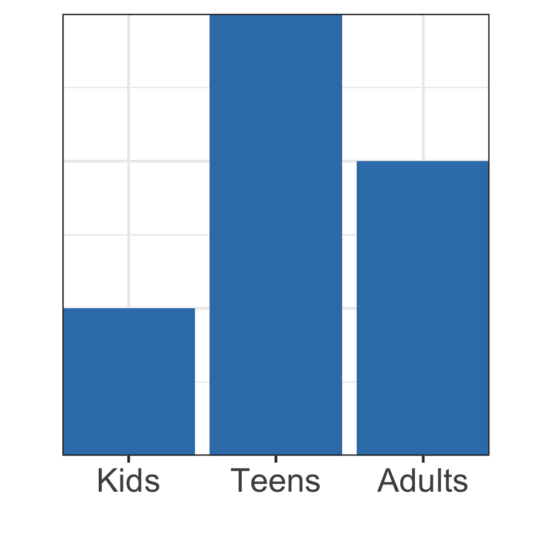
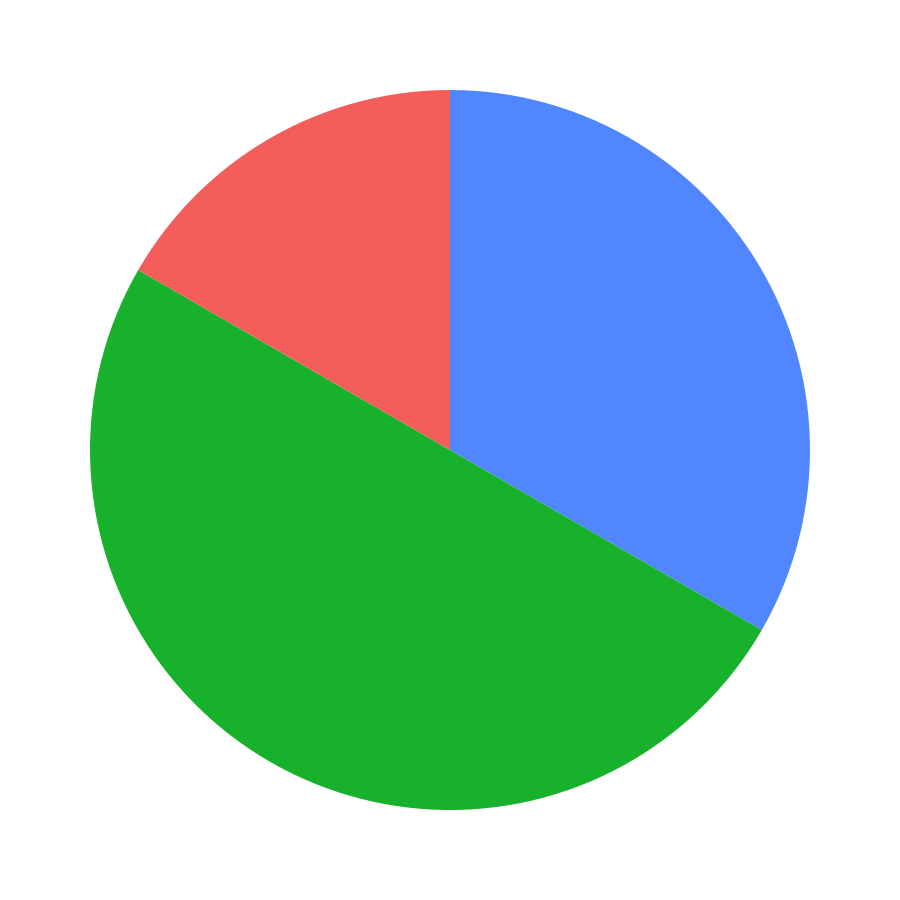
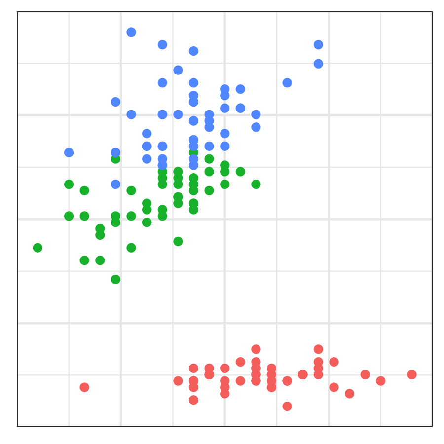
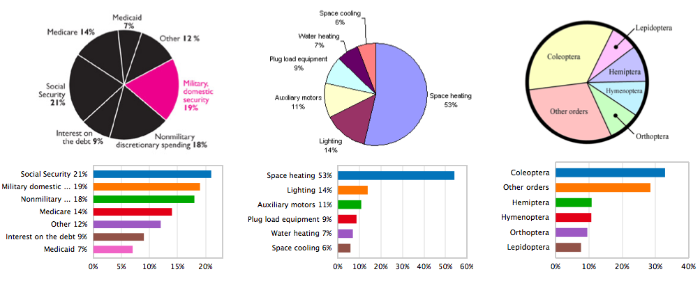

```{r setup, include=FALSE}
knitr::opts_chunk$set(
	echo = FALSE,
	message = FALSE,
	warning = FALSE
)
library("tidyverse")
library("ggrepel")
library("patchwork")
library("scales")
library("sn")
```

# Charts and Plots {.tabset}

Charts are the most common type of data visualisation, and certainly the most varied. However, it's important to note that many readers will be confused by chart types that they have not seen before. Charts should be as easy to consume as possible. In general, a **chart is used to present/compare data** and a **plot is used in the analysis of variables**.

These are the most widely used easy to create and read charts; column charts, barcharts, piecharts, scatter plots and histograms.

```{r cache = TRUE}
example_age_data <- tribble(
  ~age.group, ~count,
  "Kids", 1,
  "Teens", 3,
  "Adults", 2
) %>%
  mutate(age.group = fct_relevel(age.group, c("Kids", "Teens", "Adults")))

gg_age_col <- example_age_data %>% 
  ggplot(aes(x = age.group, y = count)) +
  geom_col(fill = "#377eb8") +
  scale_x_discrete(expand = c(0, 0)) +
  scale_y_continuous(expand = c(0, 0)) +
  theme_bw() +
  labs(x = "", y = "") +
  theme(axis.title.y=element_blank(),
        axis.text.y=element_blank(),
        axis.ticks.y=element_blank(),
        axis.text.x = element_text(size = 13)) +
  coord_fixed()

ggsave("images/gg_age_col.png",
       gg_age_col,
       width = 3,
       height = 3)

```

```{r cache = TRUE}
gg_age_pie <- example_age_data %>%
  ggplot(aes(x = "1", y = count, fill = age.group)) +
  geom_col(width = 1, show.legend = FALSE) +
  coord_polar(theta = "y") +
  theme_void() +
  guides(fill = guide_legend(title = "Age Group"))

ggsave("images/gg_age_pie.png",
       gg_age_pie,
       width = 3,
       height = 3)
```


```{r cache = TRUE}
example_continent_data <- tribble(
  ~continent, ~value,
  "ee", 3,
  "ea", 4,
  "ou", 2,
  "oo'", 1,
  "ie", 1
)

gg_continents_bar <- example_continent_data %>%
  mutate(continent = fct_reorder(continent, value)) %>%
  ggplot(aes(x = continent,
             y = value)) +
  geom_col(fill = "#377eb8") +
  scale_x_discrete(expand = c(0, 0)) +
  scale_y_continuous(expand = c(0, 0)) +
  theme_bw() +
  labs(x = "", y = "") +
  theme(axis.title.x=element_blank(),
        axis.text.x=element_blank(),
        axis.ticks.x=element_blank(),
        axis.text.y = element_text(size = 13)) +
  coord_fixed() +
  coord_flip()

ggsave("images/gg_continents_bar.png",
       gg_continents_bar,
       width = 3,
       height = 3)
```

```{r cache = TRUE}
gg_iris_scatter <- iris %>%
  as_tibble() %>%
  mutate_if(is.numeric, funs(rescale(., to = c(0.05, 0.95)))) %>%
  ggplot(aes(x = Sepal.Width,
             y = Petal.Length,
             color = Species)) +
  geom_point(show.legend = FALSE) +
  labs(x = "", y = "") +
  theme_bw() +
  scale_x_continuous(expand = c(0, 0), limits = c(0, 1)) +
  scale_y_continuous(expand = c(0, 0), limits = c(0, 1)) +
  theme(axis.title.x=element_blank(),
        axis.text.x=element_blank(),
        axis.ticks.x=element_blank(),
        axis.title.y=element_blank(),
        axis.text.y=element_blank(),
        axis.ticks.y=element_blank()
        ) +
  coord_fixed()

ggsave("images/gg_iris_scatter.png",
       gg_iris_scatter,
       width = 3,
       height = 3)

```

```{r cache = TRUE}
gg_diamonds_histogram <- diamonds %>%
  mutate(carat = rescale(carat, to = c(0, 1))) %>%
  ggplot() +
  geom_histogram(aes(x = carat, y = ..ncount..), fill = "#377eb8") +
  theme_bw() +
  scale_x_continuous(expand = c(0, 0), limits = c(0, 1)) +
  scale_y_continuous(expand = c(0, 0), limits = c(0, 1)) +
  theme(
        axis.text.x=element_text(size = 12),
        axis.ticks.x=element_blank(),
        axis.title.y=element_blank(),
        axis.text.y=element_blank(),
        axis.ticks.y=element_blank()
        ) +
  labs(x = "", y = "") +
  coord_fixed()

ggsave("images/gg_diamonds_histogram.png",
       gg_diamonds_histogram,
       width = 3,
       height = 3)
```

<center>
</img>
</img>
</img>
</img>
</img>
</center>

## Chart Purpose {#chart-purpose}

When designing a data visualisation you must think carefully about **the story the dataviz tells** your reader, or **what questions does this dataviz answer?** For simplicity, let's use the excellent [Financial Time's Visual Vocabulary](http://ft-interactive.github.io/visual-vocabulary/) to create four types of story we can tell:

<div class='row'>

<div class='col-sm-6'>

- Comparison/Ranking/Magnitude Stories:
  - How much data is there?
  - How many cateogires are there in a dataset?
  - What percentage of the data belongs to each category?
  - Which category has the *most* items in it?

</div>

<div class='col-sm-6'>

- Deviation Stories:
  - What lead did candidate X have in the election?
  - In which regions did candidate X lead over candidate Y?

</div>

</div>

<div class='row'>

<div class='col-sm-6'>

- Correlation Stories:
  - Are variables X and Y correlated?
  - How well does your model fit your data?

</div>

<div class='col-sm-6'>

- Distribution Stories:
  - What's the age distribution in country X?
  - How does the age distribution vary between country X and Y?
  - What are the min and max values for each category in your data?

</div>

</div>

### Example Stories: Brexit Referendum 2016

To demonstrate the different types of stories we can tell with charts, let's consider a public dataset; the results of the [United Kingdom's Brexit Referendum](https://www.electoralcommission.org.uk/find-information-by-subject/elections-and-referendums/past-elections-and-referendums/eu-referendum/electorate-and-count-information). In the referendum, voters were asked to select between one of two options; Remain a member of the European Union or Leave the European Union.

- **Who won?** This is a magnitude story, we care about whether Remain or Leave got more of the vote. A horizontal barchart is an excellent choice for this story, note it's important to order the bars from largest to smallest. [See the Financial Time's Visual Vocabulary for more example dataviz.](http://ft-interactive.github.io/visual-vocabulary/) 

```{r fig.height=1, fig.width=4,fig.align='center'}
brexit_votes <- read_csv("data/EU-referendum-result-data.csv")

gg_brexit_overall_result <- brexit_votes %>%
  summarise_at(vars(one_of("Remain", "Leave")), funs(sum)) %>%
  gather() %>%
  mutate(value = 100 * value / sum(value)) %>%
  mutate(value = round(value, 1)) %>%
  ggplot(aes(x = fct_reorder(key, value), y = value)) +
  geom_col(fill = "#377eb8") +
  scale_x_discrete(expand = c(0, 0)) +
  scale_y_continuous(expand = c(0, 0)) +
  theme_bw() +
  labs(x = "", y = "") +
  theme(
    axis.title.y = element_blank(),
    axis.text.x = element_text(size = 10),
    axis.ticks.y = element_blank(),
    axis.text.y = element_text(size = 13),
    plot.margin=grid::unit(c(0,0,0,0), "mm")
  ) +
  geom_text(aes(label = paste0(value, "%")), nudge_y = -6, size = 4, color = "white") + 
  coord_flip() +
  labs(title = "Magnitude: Did more people vote Leave or Remain?")
gg_brexit_overall_result
```

- **How did voter turnout compare between the regions of the UK?** This is a comparison story, note that if there's a sensible way to rank values in your data it will make the dataviz easier to read. While a horizontal barchart could work for this data, we've chosen to use a horizontal lollipop chart as we care about the voter turn out values and not 'which region had the biggest impact on the referendum'. [See the Financial Time's Visual Vocabulary for more example dataviz.](http://ft-interactive.github.io/visual-vocabulary/) 

```{r fig.height=3, fig.width=5, fig.align='center'}
brexit_votes %>%
  group_by(Region) %>%
  summarise_at(vars(one_of("Electorate", "Votes_Cast")), funs(sum)) %>%
  mutate(turnout.percentage = 100 * Votes_Cast / Electorate) %>%
  mutate(turnout.percentage = round(turnout.percentage)) %>%
  ggplot(aes(x = fct_reorder(Region, turnout.percentage), y = turnout.percentage)) +
  scale_y_continuous(limits = c(60, 80), expand = c(0, .1)) +
  geom_segment(aes(x = fct_reorder(Region, turnout.percentage), xend = fct_reorder(Region, turnout.percentage), y = 60, yend = turnout.percentage)) +
  geom_point(size = 4) +
  geom_text(aes(label = paste0(turnout.percentage, "%")), nudge_y = 2, size = 3) +
  theme_bw() +
  theme(
    axis.text.x = element_text(size = 12),
    axis.text.y = element_text(size = 12),
    axis.title.x = element_blank(),
    axis.ticks.x = element_blank(),
    axis.ticks.y = element_blank()
  ) +
  labs(x = "", y = "",
       title = "Comparison: How did voter turnout compare geographically?") +
  coord_flip()
```

- **How did the results vary between regions?** This is a deviation question, as we're asking what is the variance from 50:50 for each region. Stacked barcharts are very good options for this purpose, as always with barcharts the order of the categories matters. The first chart is a very good chart if you have the specific question, "How did Leaves margin vary between regions". [See the Financial Time's Visual Vocabulary for more example dataviz.](http://ft-interactive.github.io/visual-vocabulary/) 

```{r fig.height=4.5, fig.width=10, fig.align='center'}
brexit_region_breakdown <- brexit_votes %>%
  group_by(Region) %>%
  summarise_at(vars(one_of("Remain", "Leave")), funs(sum)) %>%
  gather(vote, count, 2:3) %>%
  group_by(Region) %>%
  mutate(total.votes = sum(count)) %>%
  group_by(Region, vote) %>%
  summarise(vote.percentage = count / sum(total.votes)) %>%
  ungroup()

vote_value <- tibble(
  vote = c("Leave", "Remain"),
  multiplier = c(1, -1)
)

brexit_region_breakdown <- brexit_region_breakdown %>%
  left_join(vote_value) %>%
  mutate(signed.vote.percentage = vote.percentage * multiplier) %>%
  mutate(vote = fct_relevel(vote, c("Leave", "Remain"))) %>%
  group_by(Region) %>%
  mutate(leave.edge = sum(signed.vote.percentage)) %>%
  arrange(desc(leave.edge)) %>%
  ungroup()


gg_brexit_region_leave_margin <- brexit_region_breakdown %>%
  ggplot(aes(x = fct_reorder(Region, leave.edge), y = vote.percentage)) + 
  geom_col(width = 0.95, aes(fill = vote), show.legend = FALSE) +
  scale_fill_manual(values = c("#0069b5", "#ffc010")) +
  scale_x_discrete(expand = c(0, 0)) +
  scale_y_continuous(expand = c(0, 0), labels = scales::percent) +
  geom_hline(aes(yintercept = 0.5), color = "white", size = 1) +
  coord_flip() +
  theme_bw(base_size = 12) +
  theme(plot.title = element_text(size=10)) + 
  labs(x = "", y ="", fill = "", title = "Ordered by Leave margin")

gg_brexit_region_differences <- brexit_region_breakdown %>%
  group_by(Region) %>%
  mutate(vote.deviation = abs(diff(vote.percentage))) %>%
  ggplot(aes(x = fct_reorder(Region, vote.deviation), y = vote.percentage)) + 
  geom_col(width = 0.95, aes(fill = vote), show.legend = TRUE) +
  scale_fill_manual(values = c("#0069b5", "#ffc010")) +
  scale_x_discrete(expand = c(0, 0)) +
  scale_y_continuous(expand = c(0, 0), labels = scales::percent) +
  geom_hline(aes(yintercept = 0.5), color = "white", size = 1) +
  coord_flip() +
  theme_bw(base_size = 12) +
  theme(plot.title = element_text(size=10)) + 
  labs(x = "", y ="", fill = "", title = "Ordered by greatest deviance from 50:50")

gg_brexit_region_leave_margin + gg_brexit_region_differences


```

- **Does the vote margin depend on region populaton?** This is a (fairly silly) correlation question, as we're asking do larger regions tend to have a smaller/larger margins. Scatter plots are the most useful type of chart for these questions. In general, a *chart* is used to present/compare data and a *plot* is used in the analysis of variables. [See the Financial Time's Visual Vocabulary for more example dataviz.](http://ft-interactive.github.io/visual-vocabulary/) 

```{r fig.height=4.5, fig.width=10, fig.align='center'}

brexit_vote_deviation <- brexit_region_breakdown %>%
  group_by(Region) %>%
  summarise(vote.deviation = abs(diff(vote.percentage)))

brexit_region_population <- brexit_votes %>%
  group_by(Region) %>%
  summarise(total.electorate = sum(Electorate))

gg_region_deviation <- brexit_vote_deviation %>%
  left_join(brexit_region_population) %>%
  ggplot(aes(y = vote.deviation, x = total.electorate)) +
  geom_point() +
  theme(plot.title = element_text(size=10)) + 
  theme_bw(base_size = 12) +
  labs(x = "Population", y = "Absolute Variation", fill = "", title = "Region population vs Vote deviation") +
  scale_x_continuous(labels = scales::comma)

gg_area_deviation <- brexit_votes %>%
  select(Area, Electorate, Remain, Leave) %>%
  mutate(perc = Remain / Electorate) %>%
  mutate(diff = abs(0.5 - abs(perc))) %>%
  ggplot(aes(x = Electorate, y = diff)) +
  geom_point() +
  theme(plot.title = element_text(size=10)) + 
  theme_bw(base_size = 12) +
  labs(x = "Population", y = "Absolute Variation", fill = "", title = "Constitutuency population vs Vote deviation") +
  scale_x_continuous(labels = scales::comma)

gg_region_deviation + gg_area_deviation
```

- **How do the populations of the different constituencis vary?** This is a distribution story, as we want readers to understand the minimum, maximum and "average" constituency population sizes. [See the Financial Time's Visual Vocabulary for more example dataviz.](http://ft-interactive.github.io/visual-vocabulary/) 

```{r fig.height=4.5, fig.width=10, fig.align='center'}
gg_brexit_constituency_histogram <- brexit_votes %>%
  select(Area, Electorate, Region) %>%
  ggplot(aes(x = Electorate)) +
  geom_histogram(aes(y = ..count.. / sum(..count..)), fill = "#377eb8") +
  theme(plot.title = element_text(size=10)) + 
  theme_bw(base_size = 12) +
  labs(x = "Population", y = "", fill = "", title = "Constitutuency population distribution") +
  scale_y_continuous(expand = c(0, 0), labels = scales::percent) +
  scale_x_continuous(expand = c(0, 0), labels = scales::comma)

gg_brexit_constituency_violins <- brexit_votes %>%
  select(Area, Electorate, Region) %>%
  filter(Area != "Northern Ireland") %>%
  ggplot(aes(x = Region, y = Electorate)) +
  geom_violin(fill = "#377eb8") +
  theme(plot.title = element_text(size=10)) + 
  theme_bw(base_size = 12) +
  labs(x = "", y = "Population", fill = "", title = "Constitutuency population distribution\nsplit by region") +
  scale_x_discrete(expand = c(0, 0)) +
  scale_y_continuous(expand = c(0, 0), labels = scales::comma) +
  coord_flip()


gg_brexit_constituency_histogram + gg_brexit_constituency_violins
```


## Types of Data

Chart selection is heavily dependent on what **types** of data you have. Many dataviz tools automatically recommend charts to you based on the data type definitions below. Let's consider an example dataset:

> You've collected exam results from an exam with 100 questions, taken by 200 students. In the data you have three columns; grade, number of correct responses, and percentage of correct responses.

<center>
```{r}
descriptive_score_points <- tribble(
  ~label, ~value, ~y, 
  "Perfect", 6, 3,
  "Good", 4.2, 3,
  "Pass", 1.8, 3,
  "Fail", 0, 3
)

descriptive_score_labels <- tribble(
  ~label, ~value, ~y, 
  "Merit", 5, 3,
  "Pass", 3, 3,
  "Fail", 1, 3
)


correct_score <- tribble(
  ~label, ~value, ~y,
  "0 correct", 0, 2,
  # "1 correct", 1, 2,
  # "2 correct", 2, 2,
  "50 correct", 3, 2,
  # "4 correct", 4, 2,
  # "5 correct", 5, 2,
  "100 correct", 6, 2
)

percentage_score <- tribble(
  ~label, ~value, ~y,
  "0%", 0, 1,
  # "16%", 1, 1,
  "50%", 3, 1,
  # "83%", 5, 1,
  "100%", 6, 1
)


gg_types_of_data <- ggplot() +
  geom_line(data = descriptive_score_points,
            aes(x = value, y),
            linetype = 2) +
  geom_point(data = descriptive_score_points,
             size = 3, aes(x = value, y = y)) +
  geom_text(data = descriptive_score_labels,
            aes(label = label, x = value, y), nudge_y = 0.25) +
  geom_line(data = correct_score,
            aes(x = value, y),
            linetype = 1) +
  geom_point(data = correct_score,
             size = 3, aes(x = value, y = y)) +
  geom_text(data = correct_score,
            aes(label = label, x = value, y), nudge_y = 0.25) +
  geom_line(data = percentage_score,
            aes(x = value, y)) +
  # geom_point(data = percentage_score,
  #            size = 3, aes(x = value, y = y)) +
  geom_text(data = percentage_score,
            aes(label = label, x = value, y), nudge_y = 0.25) +
  scale_y_continuous(expand = c(0, 0.2)) +
  theme_void()

ggsave("images/gg_types_of_data.png",
       gg_types_of_data,
       width = 8,
       height = 2)
 # knitr::include_graphics("images/gg_types_of_data.png")
```
</img>
</center>

- Grades: This is a **categorical** and **discrete variable** as there are a limited set of available values. Because the *order* of these values is important (i.e. "Fail" should always be displayed before "Pass") this is also an **ordinal variable**.

- Number of correct responses: This is a **discrete variable** as students can only answer an integer number of questions correctly.

- Percentage of correct responses: This is a **continuous variable** as results can vary between 0 - 100%. However, *practically* this is a discrete variable .

A common issue with discrete variables masquerading as continuous variables is weird-looking histograms that are often not fit for purpose; **the charts below** (histogram, violin chart, column chart) all display the distribution of exam result percentages differently. The "best" chart of the three is dependent on the **story the chart is telling**.

<center>
```{r fig.height=2.5, fig.width=8}
set.seed(1)
simulated_exam_results <- tibble(
  score = round(rsn(200, 55, 20, alpha=1))
) %>%
  mutate(score = if_else(score > 100, 99, score),
         score = if_else(score <= 0, 1, score))

gg_exam_histogram <- simulated_exam_results %>%
  ggplot(aes(x = score)) +
  geom_histogram() +
  scale_x_continuous(limits = c(0, 102), expand = c(0, 0)) +
  labs(x = "Exam Score %", y = "Number of students") +
  theme_bw() +
  scale_y_continuous(expand = c(0, 0)) +
  theme(
        axis.text.x=element_text(size = 12),
        axis.text.y=element_text(size = 12),
        axis.ticks.x=element_blank(),
        axis.ticks.y=element_blank()
        )  +
  coord_fixed(ratio = 3)


gg_exams_violin <- simulated_exam_results %>%
  ggplot(aes(y = score, x = "1")) +
  geom_violin(fill = "#377eb8", alpha = 0.8) +
  geom_jitter(shape=16, position = position_jitter(0.1), size = 1) +
  # geom_dotplot(binaxis='y', stackdir='center', dotsize=1) +
  theme_bw() +
  labs(y = "Exam Score", x = "") +
  scale_y_continuous(expand = c(0, 0), limits = c(0, 100)) +
  theme(
        axis.text.x=element_text(size = 12),
        axis.text.y=element_blank(),
        axis.title.x = element_blank(),
        axis.ticks.x=element_blank(),
        axis.ticks.y=element_blank()
        ) +
  coord_flip() +
   theme(aspect.ratio = 0.7)
  


grade_bands <- tribble(
  ~grade.band, ~grade,
  1, "Fail",
  2, "Pass",
  3, "Merit"
) %>%
  mutate(grade = fct_reorder(grade, grade.band))


gg_exams_column <- simulated_exam_results %>%
  mutate(grade.band = cut(score, c(0, 30, 70, 100), label = FALSE)) %>%
  left_join(grade_bands) %>%
  count(grade) %>%
  ggplot(aes(x = grade, y = n)) +
  geom_col(fill = "#377eb8") +
  theme_bw() +
  theme(
        axis.text.x=element_text(size = 12),
        axis.text.y=element_text(size = 12),
        axis.ticks.x=element_blank(),
        axis.title.y=element_text(size = 12),
        axis.ticks.y=element_blank()
        ) +
  labs(x = "", y = "Number of Students") +
  scale_y_continuous(expand = c(0, 0)) +
  scale_x_discrete(expand = c(0, 0)) +
  coord_fixed(ratio = .02)
# gg_exams_column

gg_exam_histogram  + gg_exams_violin + gg_exams_column
```
</center>

In general, this is sufficient knowledge about variables to get the most from other more detailed resources. It's important to be careful with **ordered ordinal variables** as their intrinsic order must be well presented in the dataviz.

### Recommended Reading

As mentioned above, many charting tools automatically choose the most appropriate charts based on the type of data you have. This is a fairly mature field of research, commonly called *graphical perception theory*. Cleveland and McGill's seminal paper in 1987 [[DOI:10.2307/2288400](http://doi.org/10.2307/2288400)] was the first to systematically explore how the human perception system processes graphical data and continues to be relevant today.

<div class='row'>

<div class='col-sm-7'>

In addition to automatically recommending charts, tools like ReVision [[DOI:10.1145/2047196.2047247](https://doi.org/10.1145/2047196.2047247)] are even capable of using computer vision to take existing charts and re-design them to be more accessible and easily read by humans. 

</div>

<div class='col-sm-5'>

</img>

</div>

</div>

<!---

Add these sections: 

## Chart Colours

## Designing Good Charts

!-->

<!-- # Other -->

<!-- Charts and plots are typically used for comparing datasets, plotting raw data or for visualising mathematical expressions. There are many, many different types of charts/plot that serve wildly different purposes. -->

<!-- For help choosing which chart to use you might consider using these resources: -->

<!-- - [Financial Times' Visual Vocabulary](http://ft-interactive.github.io/visual-vocabulary/) -->
<!-- - [Visualising Data: Chart Directory](http://chartmaker.visualisingdata.com/) -->

<!-- We've chosen to split our charts up using a similar hierarchy to the FT's Visual Vocabulary. -->

<!-- ### Comparison / Ranking / Magnitude -->

<!-- <!--html_preserve--> -->
<!-- <div class="row"> -->
<!--    <div class="col-md-6"> -->
<!--    <span><a href="charts_barcharts.html">Barcharts [tutorial]</a> are very flexible visualisations that allow viewers to quickly compare the relative magnitude/ranking of multiple categories of data. By using grouped or stacked barcharts it is also possible to compare subcategories within each category.</span> -->
<!--    <br> -->
<!--    <strong>Required Data:</strong> -->
<!--    <ul> -->
<!--    <li>Categories: For instance, class of animal e.g. mammal or reptile</li> -->
<!--    <li>Values: For instance, number of animals of each class</li> -->
<!--    </ul> -->
<!--    </div> -->
<!--    <div class="col-md-4 vcenter"> -->
<!-- ```{r echo=FALSE} -->
<!-- library("highcharter") -->
<!-- library("tidyverse") -->
<!-- my_data <- tribble( -->
<!--   ~category, ~subcategory, ~value, -->
<!--   "Mammal", "human", 3, -->
<!--   "Mammal", "non-human", 4, -->
<!--   "Reptile", "snake", 6, -->
<!--   "Reptile", "iguana", 8 -->
<!-- ) -->
<!-- my_data %>% -->
<!--   hchart( -->
<!--     type = "bar", -->
<!--     hcaes( -->
<!--       x = category, -->
<!--       y = value -->
<!--     ) -->
<!--   ) %>% -->
<!--   hc_size(width = "300px", height = "300px") -->
<!-- ``` -->
<!--    </div> -->
<!--    </div> -->
<!--    <br> -->
<!-- <!--/html_preserve--> -->

<!-- <!--html_preserve--> -->
<!-- <div class="row"> -->
<!--    <div class="col-md-6"> -->
<!--    <span><a href="charts_piecharts.html">Piecharts [tutorial]</a> are useful visualisations for breaking down observations into a number of categories, the totals of which sum to 100% of the data. Piecharts are fairly widely panned as poor options for data with many categorisations, it is always possible to replace a piechart with a barchart.</span> -->
<!--    <br> -->
<!--    <strong>Required Data:</strong> -->
<!--    <ul> -->
<!--    <li>Categories: For instance, species of animal e.g. human or iguana</li> -->
<!--    <li>Values: For instance, number of animals of each species</li> -->
<!--    </ul> -->
<!--    </div> -->
<!--    <div class="col-md-4 vcenter"> -->
<!-- ```{r echo=FALSE} -->
<!-- library("highcharter") -->
<!-- library("tidyverse") -->
<!-- my_data <- tribble( -->
<!--   ~category, ~value, -->
<!--   "human", 3, -->
<!--   "non-human", 4, -->
<!--   "snake", 6, -->
<!--   "iguana", 8 -->
<!-- ) -->
<!-- my_data %>% -->
<!--   hchart( -->
<!--     type = "pie", -->
<!--     hcaes( -->
<!--       x = category, -->
<!--       y = value -->
<!--     ) -->
<!--   ) %>% -->
<!--   hc_plotOptions(pie = list(dataLabels = list(enabled = FALSE))) %>% -->
<!--   hc_size(width = "300px", height = "300px") -->
<!-- ``` -->
<!--    </div> -->
<!--    </div> -->
<!-- <!--/html_preserve--> -->


<!-- ### Correlation -->

<!-- <!--html_preserve--> -->
<!-- <div class="row"> -->
<!--    <div class="col-md-6"> -->
<!--    <span><a href="charts_scatterplots.html">Scatterplots [tutorial]</a> are very simple visualisations that allow viewers to compare the correlation between two variables, typically between multiple groups of data. Scatterplots may also include trendlines for comparison purposes, however the inclusion of error bars complicates the chart sufficiently to be counted as a separate type of chart.</span> -->
<!--    <br> -->
<!--    <strong>Required Data:</strong> -->
<!--    <ul> -->
<!--    <li>x coordinates: traditionally this is the independent variable, for instance the year a measurement is taken</li> -->
<!--    <li>y coordinates: traditionally this is the dependent variable, for instance the value of a measurement in a specific year</li> -->
<!--    </ul> -->
<!--    </div> -->
<!--    <div class="col-md-4 vcenter"> -->
<!-- ```{r echo=FALSE} -->
<!-- library("tidyverse") -->
<!-- library("gapminder") -->
<!-- library("highcharter") -->
<!-- gapminder %>% -->
<!--   group_by(continent, year) %>% -->
<!--   summarise(median.life.exp = median(lifeExp)) %>% -->
<!--   hchart(type = "scatter", -->
<!--          hcaes(x = year, y = median.life.exp, group = continent)) %>% -->
<!--   hc_size(width = "300px", height = "300px") -->
<!-- ``` -->
<!--    </div> -->
<!--    </div> -->
<!-- <!--/html_preserve--> -->

<!-- ### Distribution -->

<!-- We don't currently have any tutorials for creating these types of charts, please consider making a [pull request on GitHub](https://github.com/ox-it/OxfordIDN_charts). -->
