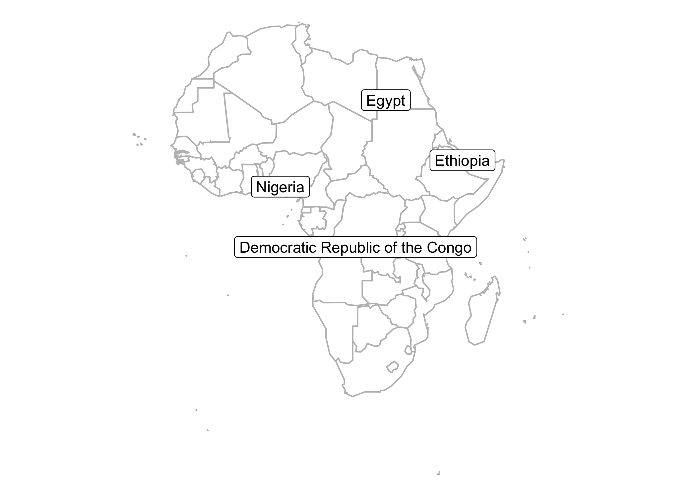

```{r setup, include=FALSE}
knitr::opts_chunk$set(
	echo = FALSE,
	message = FALSE,
	warning = FALSE
)
library("tidyverse")
library("maptools")
data(wrld_simpl)
library("sf")
library("cartogram")
library("viridis")
library("patchwork")
library("scales")
library("tilegramsR")
library("statesRcontiguous")
library("ggrepel")
library("gapminder")
library("leaflet")
library("leaflet.extras")
```


# Maps, Geoviz and GIS {.tabset}

Creating dataviz of geographic data (or showing data on a map) is a more involved process than creating charts, and requires specialist GIS software or packages. Typically, geographic dataviz seek to communicate one of five things:

<div class="row">

<div class='col-md-6'>

- **Points/Locations** on a map: buildings, cities, and countries.
- **Journeys** between locations on a map: flight paths, roads, and hurricane tracks.
- **Regions** on a map: zipcodes, city borders, and country borders.
- **Topographical properties** of Earth: ocean trenches and contour maps of mountains/hills.
- **Meteorological data**: this data often requires extremely specialised visualisations.

If you've never worked with GIS data before you're advised to consider contacting an expert as there are complex questions regarding; **map projections**, **coordinate reference systems**, **base maps** and more. This page is designed to provide you with enough information to decide what type of map and data preparation you'll need to do before talking with an expert.

</div>

<div class='col-md-6'>

<center>

```{r geoviz-maps-1}

africa_shapefiles <- wrld_simpl %>%
  st_as_sf() %>%
  filter(REGION == 2) %>%
  # st_transform("+init=epsg:3395") %>%
  st_transform(4326) %>%
  mutate(population.truncated = ifelse(POP2005 > 120e6, NA, POP2005))

palette_africa_truncated_pop <- colorBin("Purples", domain = africa_shapefiles$population.truncated, na.color = "#1b7837")

bounds <- africa_shapefiles %>%
  st_bbox() %>%
  as.list() %>%
  as_tibble()

africa_outline <- tibble(
  name = "Africa"
)

st_geometry(africa_outline) <- st_combine(africa_shapefiles)

africa_centre <- africa_outline %>%
  st_centroid() %>%
  st_coordinates() %>%
  as_tibble()

leaflet(options = leafletOptions(maxZoom = 2, minZoom = 2, 
                                 # origin = c(africa_centre$X, africa_centre$Y), 
                                 origin = c(60, 20),
                                 zoomControl = FALSE,
                                 crs = leafletCRS(origin = c(30, 0))), width = "400px", height = "300px") %>%
  addProviderTiles(providers$Esri.OceanBasemap) %>%
  addPolygons(
    data = africa_shapefiles,
    fillColor = ~palette_africa_truncated_pop(population.truncated),
    fillOpacity = 1,
    color = "black",
    label = ~NAME,
    weight = 1
  ) %>%
  addLegend(
    data = africa_shapefiles,
    pal = palette_africa_truncated_pop,
    values = ~population.truncated,
    labFormat = labelFormat(
      prefix = "", suffix = " million", between = " &ndash; ",
      big.mark = ",", transform = function(x) x / 1e6
    ),
    opacity = 1,
    na.label = "100 million+",
    title = "Country Population\nin 2005"
  ) %>%
  setView(51.328125, -5.2660078828055, zoom = 2)
```

</center>

</div>

</div>

## Types of Geoviz

```{r geoviz-maps-2, eval = FALSE}
lf_quakes <- quakes %>%
  st_as_sf(coords = c("long", "lat")) %>%
  st_set_crs(4326) %>%
  leaflet() %>%
  addProviderTiles(providers$Esri.OceanBasemap) %>%
  addCircleMarkers(clusterOptions = markerClusterOptions())
htmlwidgets::saveWidget(lf_quakes,
                        "lf_quakes.html")
webshot::webshot("lf_quakes.html",
                 file = "lf_quakes.png")
unlink("lf_quakes.html")
```

```{r geoviz-maps-3, eval = FALSE}
gg_africa_choropleth <- ggplot() +
  geom_sf(data = africa_shapefiles, aes(fill = POP2005 / 1000000)) +
  coord_sf(crs = st_crs(africa_shapefiles), datum = NA) +
  scale_fill_viridis(
    name = "Population (Millions)",
    breaks = c(1, 50, 100, 140)
  ) +
  theme_void() +
  theme(
    text = element_text(color = "#22211d"),
    plot.background = element_rect(fill = "white", color = NA),
    panel.background = element_rect(fill = "white", color = NA),
    legend.background = element_rect(fill = "white", color = NA)
  )

ggsave("gg_africa_choropleth.png",
       gg_africa_choropleth)
```

```{r geoviz-maps-4, eval = FALSE}
palette_africa_pop <- colorBin("Purples", domain = africa_shapefiles$POP2005, na.color = "#1b7837")

africa_cartogram <- africa_shapefiles %>%
  as_Spatial() %>%
  cartogram("POP2005", prepare = "remove", itermax = 8)


africa_cartogram %>%
  leaflet(options = leafletOptions(minZoom = 4, maxZoom = 5)) %>%
  addPolygons(
    fillColor = ~palette_africa_pop(POP2005),
    fillOpacity = 1,
    color = "black",
    label = ~NAME,
    weight = 1
  )


lf_africa_cartogram <- africa_cartogram %>%
  leaflet(options = leafletOptions(minZoom = 3.5, maxZoom = 3.5)) %>%
  addPolygons(
    fillColor = ~palette_africa_pop(POP2005),
    fillOpacity = 1,
    color = "black",
    label = ~NAME,
    weight = 1
  ) %>%
  setMapWidgetStyle(style = list(background = "#aacbff"))
htmlwidgets::saveWidget(lf_africa_cartogram,
                        "lf_africa_cartogram.html")
webshot::webshot("lf_africa_cartogram.html",
                 file = "lf_africa_cartogram.png")
unlink("lf_africa_cartogram.html")
```


```{r geoviz-maps-5}
library("readxl")
library("DT")
geoviz_descriptions <- read_xlsx("data/geoviz-types.xlsx")

geoviz_descriptions %>%
  datatable(options = list(dom = "t"),
            rownames = FALSE,
            escape = FALSE) 

```


<!-- ```{r} -->

<!-- ggplot() + -->
<!--   geom_sf(data = africa_shapefiles) + -->
<!--   geom_sf(data = africa_shapefiles %>% -->
<!--   st_centroid()) +  -->
<!--   coord_sf(crs = st_crs(africa_shapefiles), datum = NA) + -->
<!--   scale_fill_viridis( -->
<!--     name = "Population (Millions)", -->
<!--     breaks = c(1, 50, 100, 140) -->
<!--   ) + -->
<!--   ggtitle("Geo scatter plot") + -->
<!--   theme_void() + -->
<!--   theme( -->
<!--     text = element_text(color = "#22211d"),  -->
<!--     plot.background = element_rect(fill = "white", color = NA),  -->
<!--     panel.background = element_rect(fill = "white", color = NA),  -->
<!--     legend.background = element_rect(fill = "white", color = NA) -->
<!--   ) -->
<!-- ``` -->


<!-- ```{r} -->
<!-- uk_locations <- tribble( -->
<!--   ~lat, ~lng, -->
<!--   51.7383391,-1.2010547, -->
<!--   52.4811483,-2.1771454, -->
<!--   53.814155, -1.563959 -->
<!-- ) -->


<!-- uk_locations %>% -->
<!--   leaflet() %>% -->
<!--   addTiles() %>% -->
<!--   addMarkers() %>% -->
<!--   setMaxBounds(-7.57216793459, 49.959999905, 1.68153079591, 58.6350001085) -->

<!-- ``` -->

<!-- ```{r cache = TRUE} -->
<!-- ## Inspired by https://www.r-graph-gallery.com/331-basic-cartogram/ -->
<!-- africa_shapefiles <- wrld_simpl %>% -->
<!--   st_as_sf() %>% -->
<!--   filter(REGION == 2) %>% -->
<!--   st_transform("+init=epsg:3395") -->

<!-- gg_africa_choropleth <- ggplot() + -->
<!--   geom_sf(data = africa_shapefiles, aes(fill = POP2005 / 1000000)) + -->
<!--   coord_sf(crs = st_crs(africa_shapefiles), datum = NA) + -->
<!--   scale_fill_viridis( -->
<!--     name = "Population (Millions)", -->
<!--     breaks = c(1, 50, 100, 140), -->
<!--     guide = guide_legend( -->
<!--       keyheight = unit(3, units = "mm"), -->
<!--       keywidth = unit(12, units = "mm"), -->
<!--       label.position = "bottom", -->
<!--       title.position = 'top', -->
<!--       nrow = 4 -->
<!--     ) -->
<!--   ) + -->
<!--   theme_void() + -->
<!--   theme( -->
<!--     text = element_text(color = "#22211d"),  -->
<!--     plot.background = element_rect(fill = "white", color = NA),  -->
<!--     panel.background = element_rect(fill = "white", color = NA),  -->
<!--     legend.background = element_rect(fill = "white", color = NA) -->
<!--     # plot.title = element_text(size= 18, hjust=0.5, color = "#4e4d47", margin = margin(b = -0.1, t = 0.4, l = 2, unit = "cm")), -->
<!--     # legend.position = c(0.2, 0.46) -->
<!--   ) -->

<!-- ggsave("images/gg_africa_choropleth.png", -->
<!--        gg_africa_choropleth) -->
<!-- ``` -->

<!-- ```{r cache = TRUE} -->
<!-- simple_maps_cities <- read_csv("data/simple-maps_cities/worldcities.csv") -->

<!-- africa_shapefiles <- wrld_simpl %>% -->
<!--   st_as_sf() %>% -->
<!--   filter(REGION == 2) %>% -->
<!--   st_transform("+init=epsg:3395") %>% -->
<!--   mutate( -->
<!--     CENTROID = map(geometry, st_centroid), -->
<!--     COORDS = map(CENTROID, st_coordinates), -->
<!--     COORDS_X = map_dbl(COORDS, 1), -->
<!--     COORDS_Y = map_dbl(COORDS, 2) -->
<!--   ) -->

<!-- gg_africa_labelled <- ggplot() + -->
<!--   geom_sf(data = africa_shapefiles, fill = "white", color = "grey") + -->
<!--   coord_sf(crs = st_crs(africa_shapefiles), datum = NA) + -->
<!--   geom_label_repel(data = africa_shapefiles %>% -->
<!--                      filter(POP2005 > 50e6), aes(x = COORDS_X, -->
<!--                                                    y = COORDS_Y, label = NAME), -->
<!--                    min.segment.length = 0.5) + -->
<!--   theme_void() + -->
<!--   theme( -->
<!--     text = element_text(color = "#22211d"), -->
<!--     plot.background = element_rect(fill = "white", color = NA), -->
<!--     panel.background = element_rect(fill = "white", color = NA), -->
<!--     legend.background = element_rect(fill = "white", color = NA), -->
<!--     plot.title = element_text(size = 22, hjust = 0.5, color = "#4e4d47", margin = margin(b = -0.1, t = 0.4, l = 2, unit = "cm")), -->
<!--     legend.position = c(0.2, 0.46) -->
<!--   ) -->
<!-- ggsave("images/gg_africa_labelled.png", -->
<!--        gg_africa_labelled) -->
<!-- ``` -->

<!-- <center> -->
<!-- </img> -->
<!-- </img> -->
<!-- </center> -->


