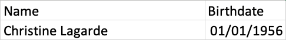

```{r setup, include=FALSE}
knitr::opts_chunk$set(
	echo = FALSE,
	message = FALSE,
	warning = FALSE
)
```

# Time series and temporal data {.tabset}

<div class='row'>

<div class='col-sm-6'>

Time series visualisations communicate how something changes over time. In almost all of these charts the x-axis (the horizontal axis) represents time.

Typically, these time series visualisations are used to communicate one of three things:

- **Precise events on a timeline**: a letter is sent, or received.
- **Periods of time**: a worker is assigned to a particular project for X days.
- **Variation in a variable over time**: stock prices or global temperature measurements over time.

When working with temporal data it's extremely important to be careful with the format of your data as the "time" component of your data may contain any combination of the following; HH:MM:SS, YYYY-MM-DD and time zone.

</div>

<div class='col-sm-6'>

```{r timeseries-1}
library("tidyverse")
library("tidyquant") # provides FANG
library("tsbox") # convert to xts
library("dygraphs")
library("lubridate")

dyUnzoom <- function(dygraph) {
  dyPlugin(
    dygraph = dygraph,
    name = "Unzoom",
    path = system.file("plugins/unzoom.js", package = "dygraphs")
  )
}

dygraph_tech_stock_prices <- FANG %>%
  select(date, symbol, open) %>%
  tsbox::ts_xts() %>%
  dygraph(main = "Tech Stock Prices (2013 - 2016)",
          width = "100%",
          height = "300px") %>%
  dyLegend(show = "follow", labelsSeparateLines = TRUE) %>%
  dyRangeSelector() %>%
  dyOptions(colors = RColorBrewer::brewer.pal(length(
    unique(FANG$symbol)
  ), "Set2"),
  fillAlpha = 1,
  fillGraph = FALSE,
  colorValue = 1,
  animatedZooms = TRUE) %>%
  dyShading(from = "2015-07-01", to = "2015-07-31", color = "#CCEBD6") %>%
  dyLimit(max(FANG$open), color = "red") %>%
  dyUnzoom() 

dygraph_tech_stock_prices


```

</div>

</div>

## Types of visualisation

```{r timeseries-2, eval = FALSE}
## inspired by http://benalexkeen.com/creating-a-timeline-graphic-using-r-and-ggplot2/

gdpr_events <- tribble(
  ~date, ~description, ~type,
  dmy("25-01-2012"), "GDPR proposal released", "Proposal",
  dmy("21-10-2013"), "The European Parliament Committee on Civil Liberties, Justice and Home Affairs (LIBE) had its orientation vote.", "Vote",
  dmy("15-12-2015"), "Negotiations between the European Parliament, Council and Commission (Formal Trilogue meeting) resulted in a joint proposal.", "Proposal",
  dmy("08-04-2016"), "The European Parliament's LIBE Committee voted for the negotiations between the three parties.", "Vote",
  dmy("14-04-2016"), "Adoption by the European Parliament", "Regulatory",
  dmy("24-05-2016"), "The regulation entered into force, 20 days after its publication", "Regulatory",
  dmy("25-05-2018"), "Its provisions became directly applicable in all member states.", "Regulatory"
)

gdpe_event_types <- tribble(
  ~type, ~color,
  "Vote", "#1b9e77",
  "Proposal", "#d95f02",
  "Regulatory", "#7570b3"
)

add_milestone_heights <- function(event_data){
  
  heights <- rep(c(1, -0.5, 0.5, -1), ceiling(nrow(event_data) / 4))[1:nrow(event_data)]
  
  event_data %>%
    mutate(height = heights)
} 


format_event_labels <- function(event_data, label_column){
  
  label_enquo <- enquo(label_column)
  
  event_data %>%
    mutate(formatted_labels = gsub("(.{30,}?)\\s", "\\1\n", !! label_enquo))
  
}

timeline_month_labels <- function(event_data, date_column = date, buffer_earliest_month = 6, buffer_latest_month = 6){
  
  date_enquo <- enquo(date_column)
  
  earliest_date <- event_data %>%
    select(!! date_enquo) %>%
    .[[1]] %>%
    min()
  
  latest_date <- event_data %>%
    select(!! date_enquo) %>%
    .[[1]] %>%
    max()
  
  tibble(
    x = seq(earliest_date - months(buffer_earliest_month), latest_date + months(buffer_latest_month), by='6 month')
  ) %>%
    mutate(label = format(x, "%b-%Y"))
}

gdpr_timeline_labels <- gdpr_events %>%
  timeline_month_labels(buffer_earliest_month = 2,
                        buffer_latest_month = 6)


gg_gdpr_events <- gdpr_events %>%
  add_milestone_heights() %>%
  format_event_labels(description) %>% 
  mutate(label_hjust = if_else(height > 0, "inward",
                               "outward")) %>%
  ggplot(
    aes(
      x = date,
      y = 0,
      label = description,
      color = type
    )
  ) +
  geom_hline(
    yintercept = 0,
    color = "black", size = 0.3
  ) +
  scale_color_manual(values = gdpe_event_types$color, labels = gdpe_event_types$type, drop = FALSE) +
  scale_fill_manual(values = gdpe_event_types$color, labels = gdpe_event_types$type, drop = FALSE) +
  geom_segment(aes(y = height, yend = 0, xend = date, x = date), color = "black", size = 0.2) +
  geom_point(aes(y = 0), size = 5) +
  geom_label(aes(x = date, y = height, label = formatted_labels, fill = type, hjust = label_hjust), alpha = 1, size = 4, vjust = 0.5, color = "WHITE", show.legend = FALSE,
             label.padding = unit(0.55, "lines")) +
  geom_label(data = gdpr_timeline_labels,
            aes(x = x, y = -0.08, label = label), size = 3, color = "black") +
  scale_x_date(limits = c(min(gdpr_timeline_labels$x), max(gdpr_timeline_labels$x))) +
  theme_void() +
theme(
  axis.line.y = element_blank(),
  axis.text.y = element_blank(),
  axis.title.x = element_blank(),
  axis.title.y = element_blank(),
  axis.ticks.y = element_blank(),
  axis.text.x = element_blank(),
  axis.ticks.x = element_blank(),
  axis.line.x = element_blank(),
  legend.position = "bottom"
)
ggsave("images/gg_gdpr_events.png",
       gg_gdpr_events)
```

```{r timeseries-3, eval = FALSE}
windows_lifecycles <- tribble(
  ~version, ~general_availability, ~end_of_mainstream_support, ~end_of_extended_support,
  "Windows XP", dmy("25-10-2001"), dmy("14-04-2009"), dmy("08-04-2014"),
  "Windows Vista", dmy("30-01-2007"), dmy("10-04-2012"), dmy("11-04-2017"),
  "Windows 7", dmy("22-10-2009"), dmy("31-10-2013"), dmy("31-10-2016"),
  "Windows 8", dmy("26-10-2012"), dmy("31-10-2014"), dmy("30-06-2016"),
  "Windows 8.1", dmy("18-10-2013"), dmy("01-09-2015"), dmy("31-10-2016"),
  "Windows 10", dmy("29-07-2015"), dmy("13-10-2020"), dmy("14-10-2025")
)

support_period_types <- tribble(
  ~support_period, ~support_period_name,
  1, "Mainstream support",
  2, "Extended support"
)

windows_support_periods <- windows_lifecycles %>%
  gather(release_type, date, 2:4) %>%
  arrange(version, desc(date)) %>%
  group_by(version) %>%
  mutate(start = date,
         end = lag(date)) %>%
  filter(!is.na(end)) %>%
  select(version, start, end) %>%
  mutate(support_period = row_number())


gg_windows_support_periods <- windows_support_periods %>%
  ggplot() +
  geom_rect(
    xmin = dmy("14-04-2009"), xmax = dmy("08-04-2014"),
    ymin = 0,
    ymax = Inf,
    aes(fill = "XP extended support"),
    size = 10
  ) +
  geom_segment(
    aes(
      x = start,
      xend = end,
      y = fct_reorder(version, start) %>% fct_rev(),
      yend = fct_reorder(version, start) %>% fct_rev(),
      color = support_period == 1
    ),
    size = 10
  ) +
  scale_colour_manual(values = c("TRUE" = "#004e98", "FALSE" = "#808080"),
                      labels = c("Mainstream support", "Extended support"),
                      name = "") +
  scale_fill_manual(values = alpha("#aebd89", 1),
                    labels = "XP extended support period",
                    name = "") +
  theme_bw(base_size = 22) +
  labs(x = "",
       y = "Windows OS version") +
  theme(legend.position="bottom")

ggsave("images/gg_windows_support_periods.png",
       gg_windows_support_periods)
```


```{r, eval = FALSE}
gg_fake_candlestick <- tibble(
  id = 100:199,
  date = seq(today() - 99, today(), by = "day"),
  noise = replicate(100, rnorm(1, mean = 0.2, sd = 3))
  ) %>%
  mutate(
  open = lag(id) + noise,
  high = lag(id) + 2 * noise,
  low = lag(id) - 2 * noise,
  close = lead(open)
  ) %>%
  ggplot(aes(x = date, y = close)) +
  geom_candlestick(aes(
  open = open,
  high = high,
  low = low,
  close = close
  )) +
  geom_ma(color = "darkgreen", n = 7) +
  scale_x_date(date_labels = "%Y %b %d") +
  theme_tq()

ggsave("images/gg_fake_candlestick.png",
       gg_fake_candlestick)
```


```{r timeseries-4}
library("readxl")
library("DT")
timeseries_descriptions <- read_xlsx("data/timeseries-types.xlsx")

timeseries_descriptions %>%
  datatable(options = list(dom = "t"),
            rownames = FALSE,
            escape = FALSE)

```

## Date and time formats

You must use both consistency and sense when working with temporal data. It is **highly** recommended that you use the [ISO 8601](https://en.wikipedia.org/wiki/ISO_8601) format:

- Date format: yyyy-mm-dd
- Time format: hh:mm:ss
- Combined date and time (UTC time zone) format: yyyy-mm-ddThh:mm:ss+00:00

If MS Excel is included in your data processing workflow it is extremely likely that your dates will have been converted into Excel format. Excel dates are an example of a epoch dates.

### Epoch dates in Excel

Epoch date systems count the number of units if time that have elapsed since an epoch (start) date/data-time. MS Excel has a particularly complicated date system. Take the Excel sheet below which contains Christine Lagarde's (Head of the MFI) date of birth:

</img>

This is stored within Excel as `20455.0`, i.e. 20,455 days since the epoch time of January 0, 1900. There's a good discussion of [why 0th January and not 1st January](https://www.joelonsoftware.com/2008/02/19/why-are-the-microsoft-office-file-formats-so-complicated-and-some-workarounds/) here.

There are many different tools for converting between MS Excel date formats and the ISO 8601 format, but these depend very much on what dataviz technology you are using.


