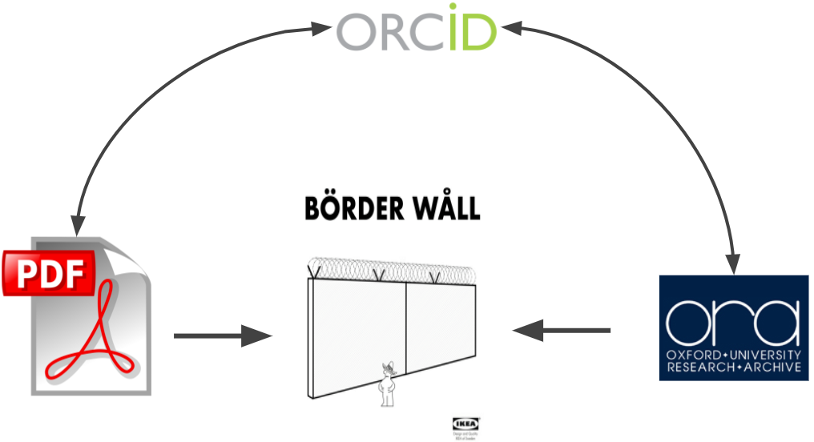
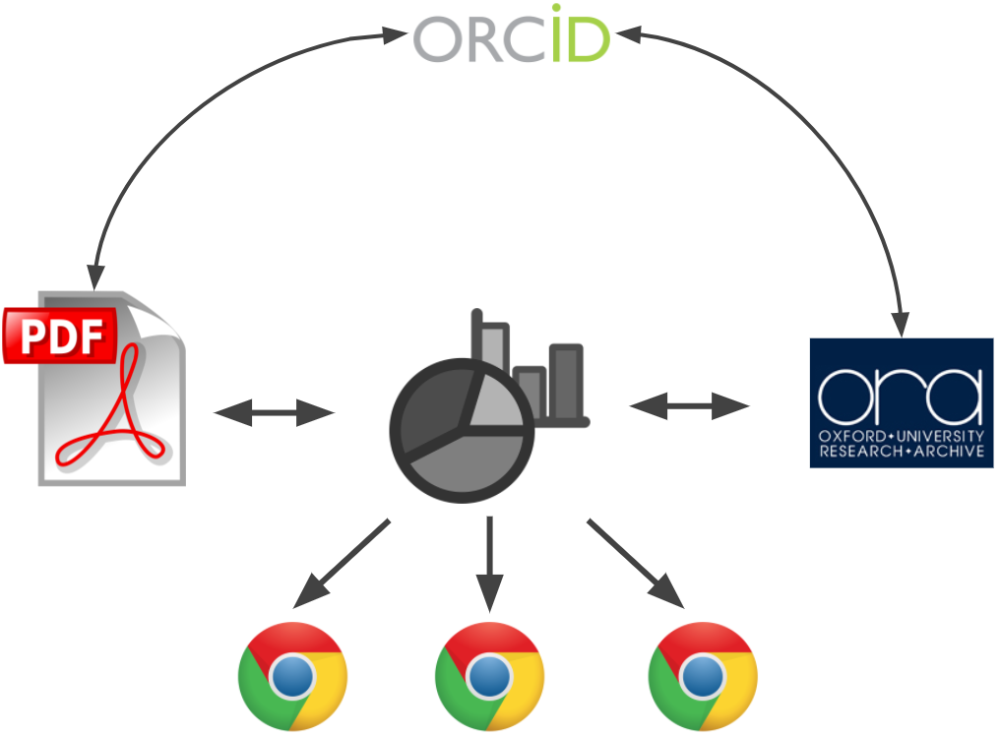

```{r include=FALSE}
knitr::opts_chunk$set(
	echo = TRUE,
	message = FALSE,
	warning = FALSE
)
```

## Why Visualise Research Data?

Visualising research data using charts, maps and graphs makes research outputs much more easily digestible and understandable to a broader audience than traditional research publications. The Interactive Data Network (IDN) particularly promotes the benefit of using interactive data visualisations as these provide an exploratory view to research datasets rather than a fixed narrative of your research findings. Interactivity can allow your audience to pose their own questions to your data and gain a more intuitive understanding of your research.

You might have heard of the so-called "data gap" - the difficulty in bridging together research publications, data deposits and researchers themselves. The cartoon below describes the problem; their are unique DOI for publications and deposits, and ORCIDs are supposed to make authorship of these outputs easy to track - but it's often difficult to obviously identify where the data behind a publication lives.

<center>

</center>

The IDN promotes the use of interactive data visualisations to bridge this gap; static visualisations hold no promise of there being actual data underlying them. Whereras if a reader encounters interactivity, and the ability to select individual data within a visualisation, then it implies that the data must be available somewhere to power the visualisation. We encourage researchers to embed these visualisations everywhere they can; personal and research group websites, within publications and in press coverage. Within these visualisations we encourage researchers to include DOI for the associated publications and datasets, as well as their own ORCID - the visualisation then becomes a central gateway for all of the research outputs.

<center>

</center>

The IDN has a webpage dedicated to [showcase visualisations](idn.it.ox.ac.uk/visualisation-showcase){target="_blank"} that demonstrate how you can bridge the gap between publication and deposited data. 

## What technology supports this?

The [visualisation tools page](tools.html) page discusses the various technologies that the IDN supports University of Oxford reseachers in using. However, note that [Shiny](tools.html#tools-shiny) is the only tool that currently allows data to be pulled in from external data repositories directly into your visualisations.

## Choosing visualisations

This website contains pages dedicated to five different categories of visualisation, where we attempt to provide some advice to help you choose appropriate visualisations for your data.

- [Charts](charts.html): These includes barcharts, piecharts, scatter plots and a host of other visualisations useful for visualising raw data, comparing datasets or communicating statistical properties of datasets.
- [Geoviz (Maps)](geoviz_maps.html): These include scatter geo plots and choropleth and are useful for visualising geographic data pertaining to planet Earth (whether that's physical, social or political data).
- [Networks](networks.html): These are visualisations designed to visually represent the connections between entities/individuals/nodes, for instance relations in a family tree or the collaborations between historical persons.
- [Time Series](time-series.html): These are useful for presenting the variation in data over time, often used for financial data.
- [Other Visualisations](other.html): These visualisations are difficult to other categories, including interactive tables and Venn diagrams.

In addition to these resources, we highly recommend the following online tools for helping to choose which visualisation is most appropriate for your data:

- [Financial Times' Visual Vocabulary](http://ft-interactive.github.io/visual-vocabulary/)
- [Visualising Data: Chart Directory](http://chartmaker.visualisingdata.com/)

## Advice on adding interactivity

When designing interactive data visualisations there is often an impulse to over-design and to add too many features. The IDN recommends following [Ben Shneiderman's mantra](https://doi.org/10.1109/VL.1996.545307):

- "Overview first, zoom and filter, then details-on-demand"

This advice translates into the following practical tips:

- Choose the most appropriate visualisation(s) for your data, if using multiple visualisations allow users to switch wholesale between them - for instance using different tabs.
- Enable zoom/pan controls in the visualisation
- Provide users with sliders, menus, buttons to filter the data shown within the visualisation
- Display tooltips when users mouseover/hover over data within a visualisation
- Provide summary details (including additional visualisations if appropriate) when the user clicks/selects data within the visualisation
